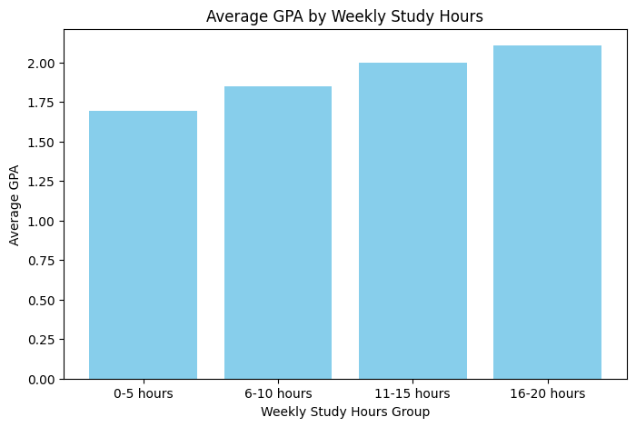
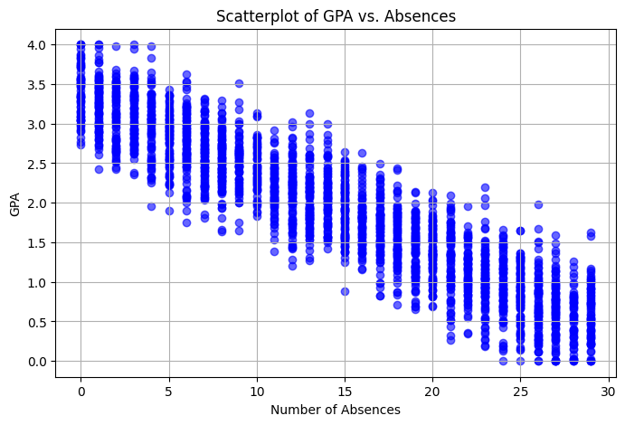
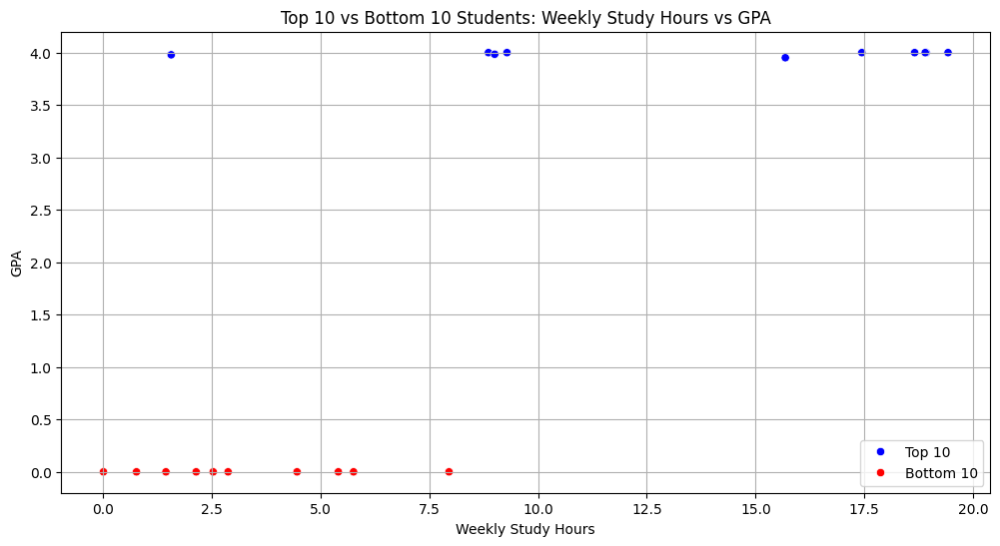
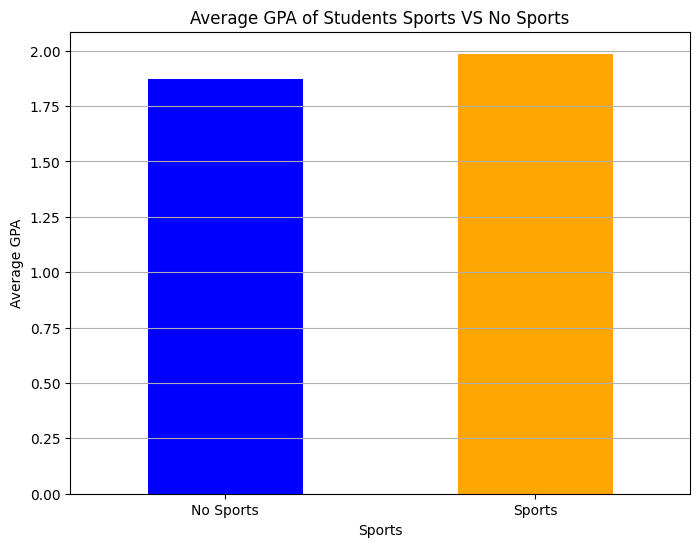
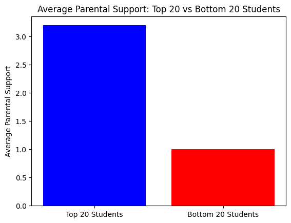
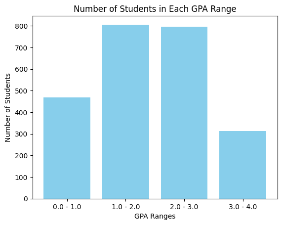
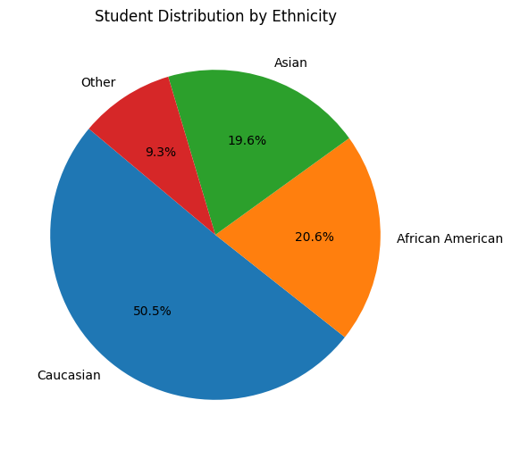
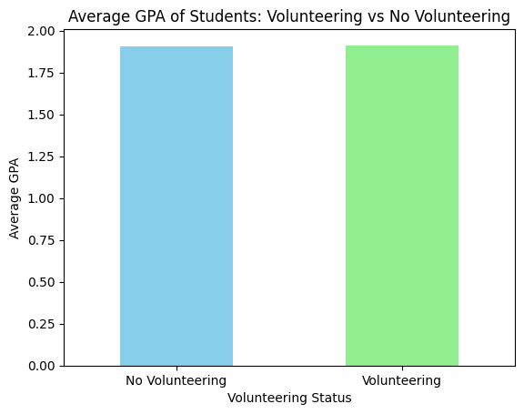

## Dataset
[Student Performance](https://www.kaggle.com/datasets/rabieelkharoua/students-performance-dataset)

## Why did I choose this dataset?
I wanted to analyze students' performance and see if there was any correlation between a multitude of factors such as age, parental education, extracurricular activities, and more.

## Progress
- [X] Picked dataset
- [ ] Defined 10 questions
- [ ] Answered 10 questions using Pandas
- [ ] Added at least one data visualization (using Matplotlib and/or Seaborn) to each single question
- [ ] Prepared presentation slides to present at graduation

## Questions
- [X] Question 1: What is the average GPA of students who receive tutoring versus no tutoring?
  - Answer: Tutoring GPA: 2.10
  - No Tutoring GPA: 1.81
  - Visualization: 
    
- [X] Question 2: What is the average GPA of students grouped by weekly study hours?
  - Answer: 0-5 hours  1.691647
     6-10 hours  1.849145
    11-15 hours  1.999016
    16-20 hours  2.105937
  - Visualization: 

- [X] Question 3: Max number of absences? Is there any correlation between the number absences and GPA?
  - Answer: 29
  - Visualization: 

- [X] Question 4:Top 10 Students Versus Bottom 10
  - Answer: See Graph
  - Visualization: 

- [X] Question 5: What is the average GPA of students who are involved in sports versus those who are not?
  - Answer: No Sports: 1.871240
  Sports: 1.986381
  - Visualization: 

- [X] Question 6: What is the average parental support for the top 20 students and the lower 20 students?
  - Answer: Average Parent Support Top 20 GPA:  3.2
    Average Parent Support Bottom 20 GPA:  1.0
  - Visualization: 

- [X] Question 7: How many students have between 0.0 - 1.0 GPA? 1.0 - 2.0? 2.0 - 3.0? 3.0 - 4.0?
  - Answer: Number of students with GPA in range 0.0 - 1.0: 468
  Number of students with GPA in range 1.0 - 2.0: 806
  Number of students with GPA in range 2.0 - 3.0: 797
  Number of students with GPA in range 3.0 - 4.0: 314

  - Visualization: 

- [X] Question 8: What is the ethnic breakdown of the sample?
  - Answer: Caucasian: 1207
African American: 493
Asian: 470
Other: 222
  - Visualization: 

- [X] Question 9: What is the average GPA of students involved in volunteering versus those who are not?
  - Answer: No Volunteering: 1.904899
Volunteering: 1.913089
  - Visualization: 

- [ ] Question 10: [Brief description of the task]
  - Answer: [Placeholder for answer]
  - Visualization: 
