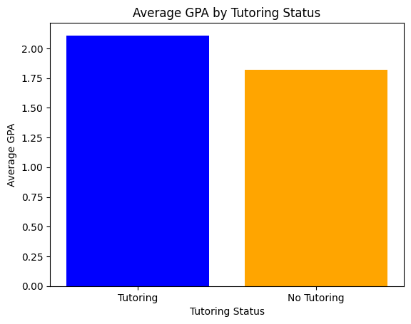

## Dataset
[Student Performance](https://www.kaggle.com/datasets/rabieelkharoua/students-performance-dataset)

## Why did I choose this dataset?
I wanted to analyze students' performance and see if there was any correlation between a multitude of factors such as age, parental education, extracurricular activities, and more.

## Progress
- [X] Picked dataset
- [ ] Defined 10 questions
- [ ] Answered 10 questions using Pandas
- [ ] Added at least one data visualization (using Matplotlib and/or Seaborn) to each single question
- [ ] Prepared presentation slides to present at graduation

## Questions
- [X] Question 1: What is the average GPA of students who receive tutoring versus no tutoring?
  - Answer: Tutoring GPA: 2.10
  - No Tutoring GPA: 1.81
  - Visualization: 
    
  - [ ] Question 2: Average GPA of students?
  - Answer: [Placeholder for answer]
  - Visualization: 

- [ ] Question 3: Is there any correlation between the number absences and GPA?
  - Answer: [Placeholder for answer]
  - Visualization: 

- [ ] Question 4:Top 10 Students Versus Bottom 10
  - Answer: [Placeholder for answer]
  - Visualization: 

- [ ] Question 5: Is there any correlation between study time and GPA?
  - Answer: [Placeholder for answer]
  - Visualization: 

- [ ] Question 6: What is the average parental support for the top 20 students and the lower 20 students?
  - Answer: [Placeholder for answer]
  - Visualization: 

- [ ] Question 7: How many students have a 4.0 GPA?
  - Answer: [Placeholder for answer]
  - Visualization: 

- [ ] Question 8: [Brief description of the task]
  - Answer: [Placeholder for answer]
  - Visualization: 

- [ ] Question 9: [Brief description of the task]
  - Answer: [Placeholder for answer]
  - Visualization: 

- [ ] Question 10: [Brief description of the task]
  - Answer: [Placeholder for answer]
  - Visualization: 
